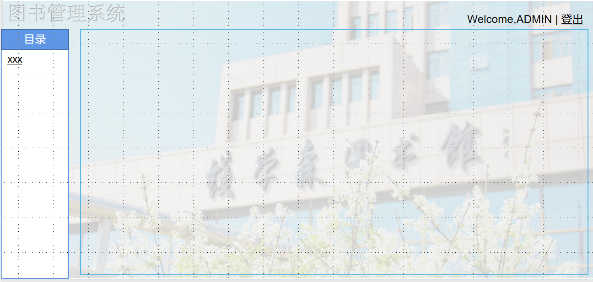

# 总体任务：

网站前台设计：前台供学生使用，学生登录后有如下权利
    图书查询：用户可以按多种方式对图书库中的图书进行查询；
    借阅信息查询：用户可以查看自己的历史借阅信息。

（架构文件中时有时无的欠款处理未加入）
网站后台设计：后台是供管理员使用的，管理员登陆后有如下权利
    办理借阅证：将学生信息填写完整，在数据库中注册新用户；
    书籍的录入及删除：可以对现有图书库中的图书进行删除，也可以添加新书；
    借书还书登记：普通用户借阅或归还图书时，管理员将在借阅信息表中添加相应的记录；
    图书修改：管理员可以对现有图书的详细信息进行修改。

**示意图≠最终效果；配色配图等还未确定 具体细节也要再看所以现在它长得丑是可以被原谅的（吧？** 

**表格内容以后端为准**

# 0 欢迎界面

点击登录按钮进入登陆页面

# 1 登陆页面

1 背景图平铺

2 窗口（长宽为页面大小的1/3）（居中）

2.1 标题：图书管理系统

2.2 用户名：输入

2.3 密码：输入

2.4 身份：（可有可无）如有则选择【管理员】/【普通用户】

示意图：

参考：

# 2 学生端窗口

学生身份登录后进入该页面（默认为2.1图书查询状态）

1 顶部 高度约为页面的1/10 

1.1 左上内容：标题 图书管理系统

1.2 右上内容： 欢迎用户登录 “Welcome”+用户名 

                            竖线后 <u>登出</u> 点击后退出登录

2 左侧目录栏 最左侧 宽度约为页面宽度1/10 

    下有两个选项 【图书查询】【借阅信息查询】，当前选中选项有选中效果

3 右侧内容 宽度约页面9/10

3.1 图书查询

3.1.1 书籍查询 

3.1.2 书籍表 内容包括：书籍名称 类别 作者 出版社 版本 状态...

2.2 借阅信息查询

显示用户的借阅信息：书籍名称、作者 出版社 版本、借阅时间、状态、用户可进行【归还】/【续借】操作

示意图

参考：

# 3 管理员端窗口

窗口基本模式与上相同

1 左侧目录栏：办理借阅证； 书籍信息修改； 借书还书登记； 

2 右侧部分

2.1 办理/注销借阅证

要求输入 用户名称 用户学号 用户密码 ，点击保存为办理成功，点击注销为注销成功

2.2 书籍信息修改

先提供查询书籍界面，管理员输入需要修改/删除/添加的书名

 点击查询→进行修改/删除；点击添加书籍→进行书籍添加

（默认状态时 查询界面下表格为目前列表中已有图书）

2.2.1 书籍修改/删除

示意图如下

2.2.2 书籍添加

2.3 借还书登记

