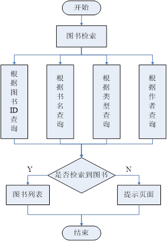

# 架构设计
[toc]
# 绪 论
图书管理系统的主要功能为
1.	图书馆图书的借阅和归还的管理自动化
2.	图书新增及销毁的及时化
3.	用户及图书信息的更新

围绕这些主要功能，本系统涉及到以下核心功能：
1. 借阅管理
2. 归还管理
3. 图书管理
4.	读者管理。

除了这些核心功能外，还包括一些基本和辅助的功能，它们是：图书信息管理，查询功能等。

该系统设计的主要目标是：

设计一个图书馆管理系统，该系统主要功能分为图书查询、图书借阅归还和图书管理三大部分。在图书查询模块中要求用户能在浏览器中分别书名、著译者、类型等条件查询；在图书管理模块中要求能完成如办理借书证（即添加新的学生）、新书录入、借书还书登记、图书修改等日常管理功能。

1. 网站前台设计：前台供读者使用，登录后有如下权利
    + 图书查询：用户可以按多种方式对图书库中的图书进行查询；
    + 借阅信息查询：用户可以查看自己的历史借阅信息。
2. 网站后台设计：后台是供管理员使用的，管理员登陆后有如下权利
   + 办理借阅证：将学生信息填写完整，在数据库中注册新用户；
   + 书籍的录入及删除：可以对现有图书库中的图书进行删除，也可以添加新书；
    + 借书还书登记：普通用户借阅或归还图书时，管理员将在借阅信息表中添加相应的记录；
    + 图书修改：管理员可以对现有图书的详细信息进行修改。

# 需求分析
##　功能需求
图书管理系统针对于两类使用者：读者和图书管理员。系统中存储两类信息：图书信息与读者信息。依据两类人群与存储信息的交互，分析功能需求。

### 与读者相关的基本功能元素

  1. 借书还书操作：最基本的功能。
     + 应该能够按照图书不同信息对图书进行查询，如书名、作者、图书类型等条件查询，（模糊搜索?）
     + 依靠借书还书操作与图书信息系统进行交互。

2. 读者信息查询：读者信息的查询内容应包括以下几个方面：

   + 读者信息——对读者的基本信息，包括借阅状态，借阅流水等，进行显示。

    + 书刊借阅——对该读者借阅书籍记录进行查询。  

    + 欠款查询(?)——对该读者超期图书的欠款情况的查看。

3. 推荐系统（选做?）：根据该读者以及其他相似读者的借阅历史为其提供推荐的图书。

### 与管理员相关的基本功能元素
1. 图书信息查询与修改：在基本的信息查询之外，增加了读者不具有的修改功能。
   + 图书馆中有哪些书籍，是否可以被借阅；
   + 查看正在被借阅的书籍信息；
   + 查看借阅流水信息(?)；
   + 对书籍的添加、修改和删除操作。
   
2. 读者信息查询与修改：在基本的信息查询之外，增加了读者不具有的修改功能。
   + 查看读者的借阅状态和借阅流水等
   + 对读者的添加、修改和删除操作。

### 总体系统的基本功能元素
从以上问题出发，可以得出本系统应该具有的功能：
1. 图书查询——对馆内的图书进行查询；
2. 借阅管理——对读者的每一次借阅，还书进行登记和管理；
3. 图书管理——对图书馆的书籍进行管理，添加、删除以及修改信息；
4. 读者管理——对读者进行管理，添加、删除以及修改信息；
5. 欠款情况管理——对读者借阅图书超期欠款的情况进行管理。
5. 推荐系统——根据该读者以及其他相似读者的借阅历史为其提供推荐的图书。
# 系统设计
## 图书馆管理系统设计指导思想和原则
1. 利用软件开发现有软硬件环境，及先进的管理系统开发方案，从而到达充分利用现在资源提高系统开发水平和应用效果的目的。
2. 系统应该符合软件工程开发的理论，开发方法等开发依据。
3. 系统应满足图书馆管理工作的需要，并达到操作过程中的直观，方便，实用，安全，准确等要求。
4. 系统应具备数据库维护功能，及时根据用户需求进行数据库的各种操作。
5. 系统采用原型，实用模块化程序设计方法，便于系统功能的各种组合和修改，以及系统的测试与维护。
6. 图书馆管理系统的设计应适合校园的发展。
## 设计模式
设计模式是面向对象的程序设计人员用来解决编程问题的一种形式化表示。本系统开发采用目前一种广泛流行的软件设计模式MVC。MVC（Model—View—Controller）应用程序结构被用来分析分布式应用程序的特征。这种抽象结构能有助于将应用程序分割成若干逻辑部件，使程序设计变得更加容易。把一个应用的输入、处理、输出流程按照Model、View、Controller的方式进行分离，这样一个应用被分成三个层——模型层、视图层、控制层。

   

图4-1MVC模式

MVC模式的出现，很好的解决了传统开发WEB应用方式中存在的问题。M代表模型（Model），包含完成任务所需要的所有的行为和数据；V代表视图（View）界面，现实模型提供的数据；C代表控制器（Controller），它将模型映射到界面中，处理用户的输入并相应请求。其模型的关系如图所示。在MVC模型中，三层各尽其职、相互独立，各层内部的改变不会影响到其它层，从而降低了数据表达、数据描述和应该操作的耦合度，也能更好的实现开发中的分工，加速工程进度。
## 图书馆管理系统总体功能概述
图书管理系统包含五个模块分别是：系统登录、图书管理、学生管理、借阅信息管理、图书检索。
+ 系统登录模块：一般用户和管理员都必须登录才能进入系统，用户登录时在后台判断用户的权限类型，分为普通用户和管理员，普通用户可以对书籍进行浏览及个人借阅信息的查询，管理员可以对多种信息进行操作。
+ 图书管理模块：管理员通过验证界面进入系统后，进入到图书管理模块，可以对图书进行添加，删除、修改图书信息、查询、查看等一系列的操作。
学生管理模块：管理员可以在此模块中创建新的普通用户，并且可以对用户的信息进行修改，删除等操作。
+ 借阅信息管理模块：这是图书管系统中最重要的模块之一，管理员进入该模块中可以为普通用户办理借阅图书，归还图书的功能，并且能够实现还款的操作。
+ 图书检索模块：普通用户通过验证界面进入系统后，能够按照书名，作者等多种条件对图书进行查询操作，确保查询到的都是最新的信息。
整体系统的功能模块如图4-2所示：

图4-2 图书馆管理系统功能图

## 图书馆管理系统各功能模块概述
### 系统登录模块
用户进入系统时调用的一个模块。该模块根据用户输入的用户名、密码来判断用户的类型，跳转到该类用户的界面。

本模块的功能点包括：
1. 判断用户名和密码是否相符；
2. 根据用户的权限类型，登录到系统的制定界面操作使用。
登录功能模块流程图如图4-3所示：

 

图4-3 登录模块流程图
### 图书管理模块
在本模块中图书馆工作人员可以对图书进行管理操作。
本模块的功能点包括：
1. 	新书入库，将新进图书按其类型将图书的基本信息录入系统数据库；  
2. 	图书出库，某一部分图书会随着时间的增长及知识的更新而变得不再有收藏的价值，或者图书被损坏，这些图书就要在图书库中除去。即从图书库中删除此图书记录；
3. 	新书编码，图书入库后，需要贴上条形码，以便以后提供借阅，本系统不涉及到条形码阅读器，只是假定此过程已经生成条形码。编码只是将条形码帖于书上以唯一标识图书；
4. 	图书信息修改，图书信息由于工作人员的疏忽，而出现录入错误，提供其图书ID就可以查看图书的基本信息并对其进行修改；
图书管理功能模块流程图如图4-4所示：

 

图4-4 图书管理模块流程图

### 学生管理模块	
本模块主要是工作者对学生信息（读者借书证信息）进行管理。

本模块的功能点包括：
1. 	办理借书证，为新读者办理借书证，填写用户基本信息；
2. 	注销借书证，输入读者借书证编号，根据借书证ID删除读者表中此借书证信息；
3. 	挂失借书证，主要是将借书证的状态改为挂失，更新读者表状态字段，有图书管理员操作；
4. 	修改图书证信息，由于工作人员的疏忽，而出现办理借书证时录入信息有误，则可根据借书证编号对其信息进行查看和修改。
5. 
借书证管理功能模块流程图如图4-5所示：

 

图4-5 借书证管理模块流程图

### 借阅信息管理模块
本模块主要是工作者对图书外借和归还进行管理。

本模块的功能点包括：
1. 	图书借阅，记录借阅证编号和图书编号，进行借书过程。在数据库中插入一天借书记录，该记录包括图书ID、借书证ID、借阅日期、归还日期等；
2. 	图书归还，输入借书证编号，图书编号，根据输入的编号在借阅登记表中找到相应的记录，将借阅记录删除，并将该记录相应的数据更新到历史借阅记录信息表中；
3. 	查看借阅记录，可以根据借书证ID以及图书ID查询借阅记录。
4. 	办理还款，如读者有图书超期的情况将会有欠款，可以根据借书证的ID来为读者班里还款。
5. 
借阅信息管理功能模块流程图如图4-6所示：	

 

图4-6 借阅信息管理模块流程图

### 图书检索模块
使用该模块的用户有：读者和管理员。

本模块的功能点包括：
1. 	根据图书ID进行检索；
2. 	根据图书名称进行检索；
3. 	根据图书类型进行检索。
4. 	根据图书作者或译者进行检索。
5. 
图书检索功能模块流程图如图4-7所示：

 

图4-7 图书检索模块流程图
## 系统数据库设计
### 概念结构设计

+ 学生
   学生属性有学号、姓名、密码、性别、学院、班级、电话、email、宿舍、地址、已借书数量、创建日期。学生实体图如图4-8所示：

图4-8 学生实体图
+ 图书
   图书属性有图书编号、书名、作者、类别、单价、出版社、出版日期、总数量、当前数量、购买日期、内容摘要。图书实体图如图4-9所示：

图4-9 图书实体图

+ E—R图
根据以上实体图，分析了各个实体的属性，根据这些属性，可以得到系统的E—R图，如图4-10所示:

 
图4.10 系统E-R图
### 逻辑结构设计
根据上述功能模块的需求，设计如下主要数据库表:

   

# 系统测试
## 登录模块测试
进入系统，输入用户名和密码，根据用户身份的不同，显示的操作菜单有所不同，一般读者只能查看图书信息和个人信息，并可以查询自己的借阅图书的历史记录；图书管理员可以对图书信息，读者信息以及借阅信息进行查看和管理。当输入错误的用户名称密码时显示登录错误并自动返回登录窗口。

## 图书管理测试
图书管理员进入系统图书管理模块后，可对图书进行添加，修改，删除操作。
1. 添加图书，填写图书基本信息，点击确定按钮，添加成功跳转到成功页面并提示添加成功，可继续添加，添加失败跳转到失败页面并提示添加失败，请重新添加。当填写的信息不完全时，点击确定按钮将根据没有填写的信息给出提示。
2. 删除图书，单个删除时，点击删除则根据图书的ID删除此图书信息，成功则返回列表，不成功则提示未删除成功的原因，多选删除时也根据图书ID数组删除多个图书，并跳转到相应的提示页面。
3. 修改图书信息，点击查看图书信息时，可对图书信息进行修改，修改成功或失败跳转到相应提示页面。
## 学生管理测试
图书管理员进入系统借书证管理模块后，可对借助正进行添加，修改，注销等操作。
1. 办理借书证，填写读者基本信息，点击确定按钮，添加成功跳转到成功页面并提示添加成功，可继续添加，添加失败跳转到失败页面并提示添加失败，请重新添加。当填写的信息不完全时，点击确定按钮将根据没有填写的信息给出提示。
2. 注销借书证，单个删除时，点击删除则根据借书证编号注销此借书证，成功则返回列表，不成功则提示未删除成功的原因，多选删除时也根据借书证ID的数组删除多个借书证，并跳转到相应的提示页面。
3. 修改读者信息，点击查看读者借书证信息时，对其进行修改并根据结果成功或失败跳转到相应提示页面。
## 借阅信息管理测试
图书管理员进入系统借阅信息管理模块后，可对借阅信息进行管理操作。
1. 办理借阅，根据读者借书证编号和图书编号办理读者借阅此图书，若图书剩余数量为0，则提示不能借阅，图书数量不足，如此图书证已经借阅此图书，则提示不能借阅相同的图书，若借阅成功则转向成功界面。
2. 图书归还，根据读者借书证编号和图书编号办理归还图书，借阅信息中必须有这条信息，否则不能归还，跳转提示页面。图书归还成功后不再有这条借阅信息，图书数量加1，并且计算好欠费情况。
3. 查看借阅信息，能够根据图书编号或借书证编号查询借阅信息。
4. 办理还款，根据读者借书证编号为读者办理还款业务，根据结果能够跳转到相应的提示页面。

